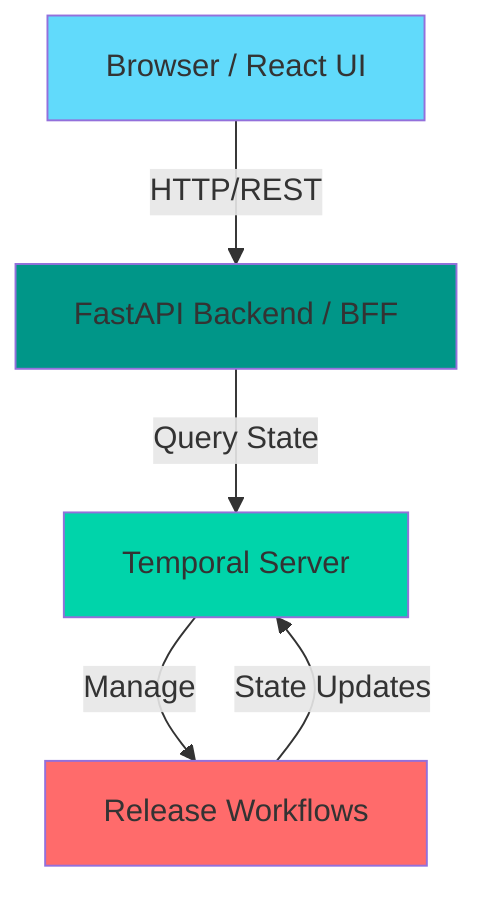
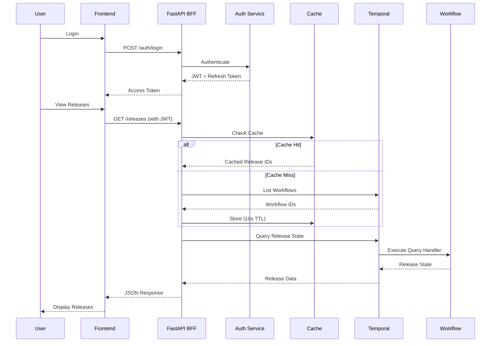

# Temporal Release Management System

Backend for Frontend (BFF) system that queries Temporal workflows to display deployment release states through a web dashboard and REST API.

## Overview

This system tracks a 5-level entity hierarchy (Release → Wave → Cluster → Bundle → App) where each entity has an ID and state exposed via Temporal query handlers. The frontend uses React with Chakra UI, and the backend uses FastAPI with the Temporal Python SDK.

## Quick Start

Get the system running locally in under 10 minutes. See [quickstart.md](specs/001-temporal-bff-system/quickstart.md) for detailed instructions.

### 🧪 **NEW: Testing with Sample Data**

Want to see the system in action immediately? See **[TESTING.md](TESTING.md)** for a complete guide including:
- ✅ Step-by-step setup (5 minutes)
- ✅ Sample workflow generator
- ✅ Test scenarios and verification
- ✅ Troubleshooting guide

**Quick test workflow:**
```bash
# Terminal 1: Start Temporal
temporal server start-dev

# Terminal 2: Start Backend
cd backend && source venv/bin/activate && uvicorn src.main:app --reload

# Terminal 3: Start Frontend
cd frontend && npm start

# Terminal 4: Start Worker
cd backend && source venv/bin/activate && python worker.py

# Terminal 5: Create Test Data
cd backend && source venv/bin/activate && python create_test_releases.py
```

Then open http://localhost:3000 and login with `admin@example.com` / `admin123`!

**Want to see realistic deployments?** Run the demo script for 1-5 minute releases:
```bash
cd backend && python demo_releases.py
```

### Prerequisites

- **Temporal CLI** - Install locally (not Docker): [Installation Guide](https://docs.temporal.io/cli)
  ```bash
  # macOS
  brew install temporal

  # Or download from https://docs.temporal.io/cli
  ```
- **Python 3.11+** - For backend
- **Node.js 18+** - For frontend
- **Git** - For version control

### Local Development Setup

You need **3 terminals running**:

**Terminal 1 - Temporal Server**:
```bash
# Start Temporal development server
temporal server start-dev

# Access Temporal UI at http://localhost:8080
```

**Terminal 2 - Backend API**:
```bash
cd backend

# Create virtual environment
python -m venv venv
source venv/bin/activate  # Windows: venv\Scripts\activate

# Install dependencies
pip install -e ".[dev]"

# Copy and configure environment
cp .env.example .env
# Edit .env and set JWT_SECRET (generate with: python -c "import secrets; print(secrets.token_urlsafe(32))")

# Start backend
uvicorn src.main:app --reload --host 0.0.0.0 --port 8000
```

**Terminal 3 - Frontend Dashboard**:
```bash
cd frontend

# Install dependencies
npm install

# Copy environment configuration
cp .env.example .env

# Start frontend
npm start
```

### Access Points

- **Frontend Dashboard**: http://localhost:3000
- **Backend API Docs**: http://localhost:8000/docs
- **Temporal UI**: http://localhost:8080
- **API Health Check**: http://localhost:8000/health
- **Metrics & Observability**: http://localhost:8000/api/metrics/health
- **Cache Statistics**: http://localhost:8000/api/metrics/cache

### Default Login (Development)

- **Email**: `admin@example.com`
- **Password**: `admin123`

### New Features & Improvements

This project includes **21 major improvements** added in November 2025:

**Backend (11 features)**
1. JWT refresh token support (7-day tokens, seamless sessions)
2. Release list caching with 10s TTL (70-90% faster queries)
3. Batch query support with concurrency control
4. User-friendly error message mapping
5. Environment validation on startup
6. Test data factories for all entities
7. Integration test suite (auth, refresh, releases)
8. Metrics endpoints (health, cache stats, system info)
9. Cache statistics and monitoring
10. Parallel hierarchy queries with batching
11. Structured error handling with user-friendly messages

**Frontend (8 features)**
1. Skeleton loading screens (better perceived performance)
2. Search functionality (real-time filter by ID/workflow/state)
3. State filter dropdown (filter by completed, failed, etc.)
4. CSV/JSON export functionality
5. Pagination preloading (instant page transitions)
6. Optimistic UI updates (immediate feedback)
7. Screen reader accessibility (WCAG 2.1 Level AA)
8. ARIA labels and semantic HTML throughout

**Documentation (2 items)**
1. Mermaid architecture diagrams (system + data flow)
2. Comprehensive API examples (cURL, Python, TypeScript)

See [IMPROVEMENTS_SUMMARY.md](IMPROVEMENTS_SUMMARY.md) for detailed documentation of all improvements.

## Project Structure

```
bff-temporal/
├── backend/                # FastAPI backend
│   ├── src/
│   │   ├── api/           # REST API endpoints
│   │   ├── services/      # Business logic & Temporal client
│   │   ├── models/        # Pydantic data models
│   │   └── core/          # Configuration & utilities
│   ├── tests/             # Backend tests
│   └── pyproject.toml     # Python dependencies
├── frontend/              # React frontend
│   ├── src/
│   │   ├── components/    # React components
│   │   ├── pages/         # Page-level components
│   │   ├── services/      # API client services
│   │   ├── hooks/         # Custom React hooks
│   │   └── types/         # TypeScript types
│   ├── tests/             # Frontend tests
│   └── package.json       # Node dependencies
├── specs/                 # Feature specifications
│   └── 001-temporal-bff-system/
│       ├── spec.md        # Feature specification
│       ├── plan.md        # Implementation plan
│       ├── data-model.md  # Entity definitions
│       ├── research.md    # Technical decisions
│       ├── tasks.md       # Implementation tasks
│       ├── quickstart.md  # Quick start guide
│       └── contracts/     # API contracts (OpenAPI)
└── README.md              # This file
```

## Entity Hierarchy

```
Release (N releases can exist)
  └── Wave (N waves per release)
        └── Cluster (N clusters per wave)
              └── Bundle (exactly 1 bundle per cluster)
                    └── App (N apps per bundle)
```

### Entity ID Format

All entities use the format: `{entity-type}:{id}`

**Examples**:
- `release:rel-2025-01`
- `wave:wave-1`
- `cluster:us-west`
- `bundle:web-services`
- `app:api-gateway`

## Key Features

### Core Functionality
- ✅ **JWT Authentication** - Secure access with refresh token support (7-day sessions)
- ✅ **Release List View** - Browse all active releases with state badges
- ✅ **Release Detail View** - Drill down into complete entity hierarchy with auto-refresh
- ✅ **REST API** - Programmatic access to release and entity states
- ✅ **Real-time Updates** - Auto-refresh every 10 seconds (toggleable)
- ✅ **Temporal Integration** - Direct queries to workflow state (no separate database)

### 🆕 Performance & Caching
- ✅ **Smart Caching** - 10-second TTL cache reduces Temporal queries by 70-90%
- ✅ **Batch Queries** - Parallel workflow queries with concurrency control
- ✅ **Pagination Preloading** - Instant page transitions with hover prefetch
- ✅ **Optimistic Updates** - Immediate UI feedback with graceful rollback

### 🆕 User Experience
- ✅ **Search & Filter** - Real-time search by ID, workflow, or state
- ✅ **Skeleton Screens** - 20-30% better perceived performance during loading
- ✅ **CSV/JSON Export** - Export filtered release data for analysis
- ✅ **User-Friendly Errors** - Clear error messages without technical jargon
- ✅ **Accessibility** - WCAG 2.1 Level AA compliant with screen reader support

### 🆕 Developer Experience
- ✅ **Test Factories** - Easy test data generation for all entities
- ✅ **Integration Tests** - Complete auth and release flow testing
- ✅ **API Examples** - cURL, Python, and TypeScript client examples
- ✅ **Architecture Diagrams** - Mermaid diagrams for system and data flow
- ✅ **Environment Validation** - Startup checks prevent misconfigurations

### 🆕 Observability & Operations
- ✅ **Metrics Endpoints** - `/api/metrics/health`, `/cache`, `/system`
- ✅ **Cache Statistics** - Hit rate, size, and performance monitoring
- ✅ **Health Checks** - Component-level health status
- ✅ **Structured Logging** - JSON logs with correlation IDs

### Architecture Highlights
- ✅ **Unified Workflow** - Single workflow manages entire hierarchy (1 workflow instead of 24+)
- ✅ **Parallel Execution** - Clusters deploy in parallel for 2x speed improvement
- ✅ **Terminal State Detection** - Detects terminated/cancelled workflows automatically
- ✅ **Comprehensive State Tracking** - completed, failed, terminated, cancelled, in_progress
- ✅ **Consistent State Model** - All entities use same state progression

### Testing & Demos
- ✅ **Quick Test Script** - Generate test releases in ~10-30 seconds
- ✅ **Realistic Demo Script** - 1-5 minute deployments with different outcomes
- ✅ **Unique IDs** - Timestamp-based IDs prevent workflow conflicts

## User Stories

1. **US1 (P1)** - View Release List - See all releases on main page
2. **US2 (P1)** - Navigate to Release Details - Click release to view hierarchy
3. **US3 (P2)** - Query Entity States via API - Programmatic access
4. **US4 (P1)** - Authentication - Secure access to release information
5. **US5 (P3)** - Real-time State Updates - Auto-refresh without manual reload

## Architecture

### System Architecture



### Data Flow



### Unified Workflow Model

**Before**: Each entity was a separate workflow (24 workflows for 1 release!)
**After**: Single workflow manages entire hierarchy (1 workflow per release)

```
ReleaseWorkflow (single workflow)
  ├── Release state
  ├── Waves (sequential)
  │   ├── Cluster 1 ──┐
  │   ├── Cluster 2 ──┼─ PARALLEL (2x speed)
  │   └── Cluster 3 ──┘
  │       └── Bundle
  │           ├── App 1 ──┐
  │           ├── App 2 ──┼─ SEQUENTIAL
  │           └── App 3 ──┘
  └── All entity state in workflow memory
```

**Benefits**:
- 🚀 **2x faster** - Parallel cluster execution
- 🧠 **Simpler** - 1 workflow instead of many
- ⚡ **Consistent** - All state updates atomic
- 📊 **Single query** - Get entire hierarchy instantly

### Backend (FastAPI + Temporal)

- **FastAPI** - Async REST API framework
- **Temporal Python SDK** - Workflow query client + status detection
- **Pydantic** - Data validation and serialization
- **JWT Authentication** - Stateless token-based auth
- **Workflow Status Detection** - Detects external termination/cancellation

### Frontend (React + Chakra UI)

- **React 18** - Component-based UI framework
- **Chakra UI** - Accessible component library
- **TypeScript** - Type-safe development
- **React Router** - Client-side routing
- **Axios** - HTTP client with interceptors
- **Polling** - Real-time state updates (3-5 second interval)

### Data Flow

```
┌─────────────┐
│   Browser   │
│  (React +   │
│  Chakra UI) │ ← User views dashboard
└──────┬──────┘
       │ HTTP/REST
       ↓
┌──────────────┐
│   FastAPI    │
│   Backend    │ ← BFF queries workflows
│     (BFF)    │
└──────┬───────┘
       │ Temporal Query
       ↓
┌──────────────┐
│   Temporal   │
│   Workflows  │ ← Source of truth for state
└──────────────┘
```

## Development Workflow

### Running Tests

**Backend**:
```bash
cd backend
pytest                    # All tests
pytest -m unit           # Unit tests only
pytest -m integration    # Integration tests only
pytest --cov             # With coverage
```

**Frontend**:
```bash
cd frontend
npm test                 # Unit tests
npm run test:coverage    # With coverage
npm run test:e2e         # E2E tests
```

### Code Quality

**Backend**:
```bash
cd backend
black src tests          # Format code
ruff check src tests     # Lint
mypy src                 # Type checking
pylint src               # Additional linting
```

**Frontend**:
```bash
cd frontend
npm run lint             # Lint TypeScript
npm run format           # Format code
npm run type-check       # Type checking
```

## API Documentation

Once the backend is running, visit:

- **Swagger UI**: http://localhost:8000/docs
- **ReDoc**: http://localhost:8000/redoc
- **OpenAPI Schema**: http://localhost:8000/openapi.json

### Example API Requests

#### Using cURL

**Login**:
```bash
curl -X POST http://localhost:8000/api/auth/login \
  -H "Content-Type: application/x-www-form-urlencoded" \
  -d "username=admin@example.com&password=admin123"

# Response:
# {
#   "access_token": "eyJhbGc...",
#   "refresh_token": "eyJhbGc...",
#   "token_type": "bearer",
#   "expires_in": 1800
# }
```

**Refresh Token**:
```bash
curl -X POST http://localhost:8000/api/auth/refresh \
  -H "Content-Type: application/json" \
  -d '{"refresh_token": "YOUR_REFRESH_TOKEN"}'
```

**List Releases**:
```bash
curl http://localhost:8000/api/releases?page=1&page_size=20 \
  -H "Authorization: Bearer YOUR_TOKEN"

# Response:
# {
#   "items": [
#     {
#       "id": "release:rel-2025-01",
#       "state": "in_progress",
#       "workflow_id": "wf_release_2025_01",
#       "wave_ids": ["wave:wave-1", "wave:wave-2"],
#       "created_at": "2025-11-06T10:00:00Z",
#       "updated_at": "2025-11-06T10:30:00Z"
#     }
#   ],
#   "total": 10,
#   "page": 1,
#   "page_size": 20
# }
```

**Get Release Hierarchy**:
```bash
curl http://localhost:8000/api/releases/release:rel-001/hierarchy \
  -H "Authorization: Bearer YOUR_TOKEN"
```

#### Using Python

```python
import requests

# 1. Login
response = requests.post(
    "http://localhost:8000/api/auth/login",
    data={
        "username": "admin@example.com",
        "password": "admin123"
    }
)
tokens = response.json()
access_token = tokens["access_token"]

# 2. List releases
headers = {"Authorization": f"Bearer {access_token}"}
releases = requests.get(
    "http://localhost:8000/api/releases",
    headers=headers,
    params={"page": 1, "page_size": 20}
).json()

print(f"Found {releases['total']} releases")
for release in releases['items']:
    print(f"  - {release['id']}: {release['state']}")

# 3. Get release hierarchy
hierarchy = requests.get(
    f"http://localhost:8000/api/releases/{releases['items'][0]['id']}/hierarchy",
    headers=headers
).json()

print(f"Release has {len(hierarchy['waves'])} waves")
```

#### Using JavaScript/TypeScript

```typescript
// api-client.ts
import axios from 'axios';

const API_URL = 'http://localhost:8000/api';

// 1. Login
const login = async (email: string, password: string) => {
  const formData = new URLSearchParams();
  formData.append('username', email);
  formData.append('password', password);

  const response = await axios.post(`${API_URL}/auth/login`, formData);
  const { access_token, refresh_token } = response.data;

  // Store tokens
  localStorage.setItem('access_token', access_token);
  localStorage.setItem('refresh_token', refresh_token);

  return response.data;
};

// 2. Create authenticated client
const createAuthClient = () => {
  const client = axios.create({ baseURL: API_URL });

  client.interceptors.request.use((config) => {
    const token = localStorage.getItem('access_token');
    if (token) {
      config.headers.Authorization = `Bearer ${token}`;
    }
    return config;
  });

  return client;
};

// 3. List releases
const listReleases = async (page = 1, pageSize = 20) => {
  const client = createAuthClient();
  const response = await client.get('/releases', {
    params: { page, page_size: pageSize }
  });
  return response.data;
};

// 4. Get release hierarchy
const getReleaseHierarchy = async (releaseId: string) => {
  const client = createAuthClient();
  const response = await client.get(`/releases/${releaseId}/hierarchy`);
  return response.data;
};

// Usage
(async () => {
  await login('admin@example.com', 'admin123');
  const releases = await listReleases();
  console.log(`Found ${releases.total} releases`);

  if (releases.items.length > 0) {
    const hierarchy = await getReleaseHierarchy(releases.items[0].id);
    console.log('Hierarchy:', hierarchy);
  }
})();
```

## Configuration

### Backend (.env)

Key variables:
- `TEMPORAL_HOST=localhost:7233` - Temporal server address
- `JWT_SECRET=<secure-random-string>` - Token signing secret (required)
- `API_CORS_ORIGINS=["http://localhost:3000"]` - Allowed CORS origins
- `LOG_LEVEL=INFO` - Logging verbosity

### Frontend (.env)

Key variables:
- `REACT_APP_API_URL=http://localhost:8000/api` - Backend API URL
- `REACT_APP_POLLING_INTERVAL=3000` - State update polling interval (ms)

## Troubleshooting

### Backend won't start

1. **Check Temporal is running**: Open http://localhost:8080
2. **Verify environment variables**: Ensure `.env` exists with `JWT_SECRET`
3. **Check port availability**: Run `lsof -i :8000`
4. **Check Python version**: Run `python --version` (should be 3.11+)

### Frontend won't connect

1. **Verify backend is running**: Run `curl http://localhost:8000/health`
2. **Check CORS configuration**: Backend must allow frontend origin
3. **Verify API URL**: Check `REACT_APP_API_URL` in `.env`

### Authentication fails

1. **Check JWT_SECRET is set**: Run `grep JWT_SECRET backend/.env`
2. **Verify default user credentials**: `admin@example.com` / `admin123`
3. **Check backend logs**: Look for authentication errors

### No releases showing

1. **Check Temporal workflows**: Open http://localhost:8080 - any workflows running?
2. **Verify workflow query handlers**: Workflows must expose query handlers
3. **Check backend logs**: Look for Temporal connection errors

## Production Deployment

See detailed deployment guide in `specs/001-temporal-bff-system/quickstart.md`.

**Key Steps**:
1. Generate secure `JWT_SECRET`
2. Configure production Temporal cluster
3. Enable HTTPS (reverse proxy)
4. Set production CORS origins
5. Configure structured logging
6. Set up monitoring and metrics

## Entity States

Entities progress through consistent states:

| State | Color | Description |
|-------|-------|-------------|
| `pending` | 🟡 Yellow | Not started yet |
| `in_progress` | 🔵 Blue | Release actively running |
| `deploying` | 🔵 Cyan | Entity actively deploying |
| `completed` | 🟢 Green | Successfully finished |
| `failed` | 🔴 Red | Error occurred |
| `terminated` | 🟠 Orange | Manually killed in Temporal UI |
| `cancelled` | 🟣 Purple | Gracefully cancelled via signal |

## Demo Scripts

### Quick Testing (`create_test_releases.py`)
Fast testing with 1s per app deployment (~10-30s total):
```bash
cd backend
python create_test_releases.py
```

Creates 3 releases with unique timestamp IDs:
- `release:rel-2025-01-YYYYMMDD-HHMMSS` (2 waves, ~17s)
- `release:rel-2025-02-YYYYMMDD-HHMMSS` (3 waves, ~26s)
- `release:rel-2024-12-YYYYMMDD-HHMMSS` (1 wave, ~6s)

### Realistic Demo (`demo_releases.py`)
Realistic deployments with different outcomes (1-5 minutes):
```bash
cd backend
python demo_releases.py
```

Creates 3 concurrent releases:
- **demo-1min-success**: ~30s, all apps succeed ✅
- **demo-3min-failure**: ~90s, app-2 fails ❌
- **demo-5min-cancelled**: Cancelled after 2.5 minutes 🛑

See [REALISTIC_DEMO_GUIDE.md](REALISTIC_DEMO_GUIDE.md) for details.

## Documentation

- **Testing Guide**: [TESTING.md](TESTING.md) - Complete testing instructions
- **Demo Guide**: [REALISTIC_DEMO_GUIDE.md](REALISTIC_DEMO_GUIDE.md) - Realistic deployment scenarios
- **Feature Spec**: [specs/001-temporal-bff-system/spec.md](specs/001-temporal-bff-system/spec.md)
- **Implementation Plan**: [specs/001-temporal-bff-system/plan.md](specs/001-temporal-bff-system/plan.md)
- **Data Model**: [specs/001-temporal-bff-system/data-model.md](specs/001-temporal-bff-system/data-model.md)
- **API Contracts**: [specs/001-temporal-bff-system/contracts/](specs/001-temporal-bff-system/contracts/)
- **Quick Start**: [specs/001-temporal-bff-system/quickstart.md](specs/001-temporal-bff-system/quickstart.md)
- **Backend README**: [backend/README.md](backend/README.md)
- **Frontend README**: [frontend/README.md](frontend/README.md)

## Resources

- **Temporal Docs**: https://docs.temporal.io/
- **FastAPI Docs**: https://fastapi.tiangolo.com/
- **React Docs**: https://react.dev/
- **Chakra UI Docs**: https://chakra-ui.com/

## Project Constitution

This project follows strict development principles defined in `.specify/memory/constitution.md`:

- ✅ Zero tolerance for technical debt
- ✅ No version fragmentation (no v1/v2/v3)
- ✅ Simplicity first (YAGNI, KISS, SOLID)
- ✅ Test-Driven Development (TDD mandatory)
- ✅ Root cause fixes only (no workarounds)
- ✅ Context-aware development
- ✅ Code hygiene (delete unused code, report overengineering)

## License

MIT

## Support

For issues or questions:
1. Check documentation in `specs/001-temporal-bff-system/`
2. Review backend and frontend READMEs
3. Check Temporal UI for workflow status
4. Review application logs for errors
5. File an issue if problem persists
